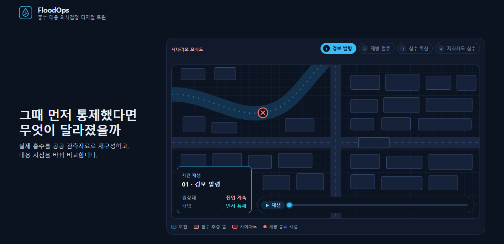
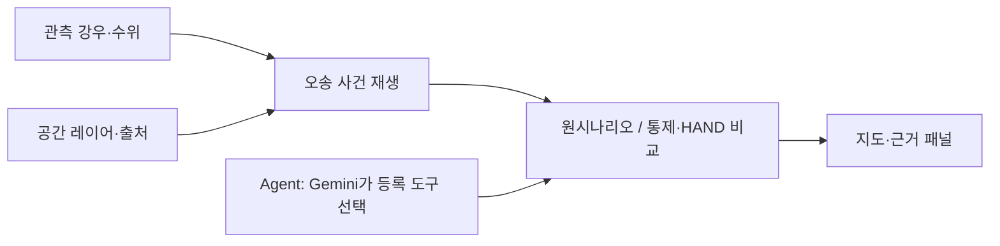
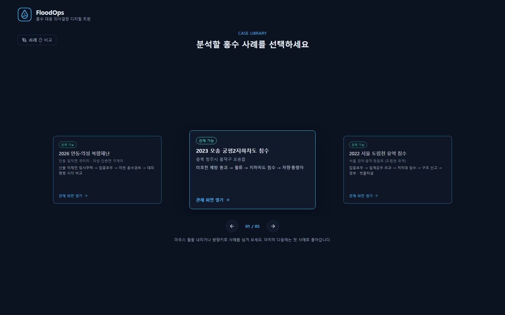
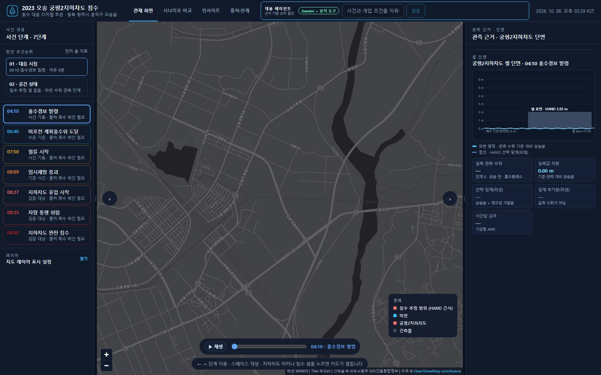
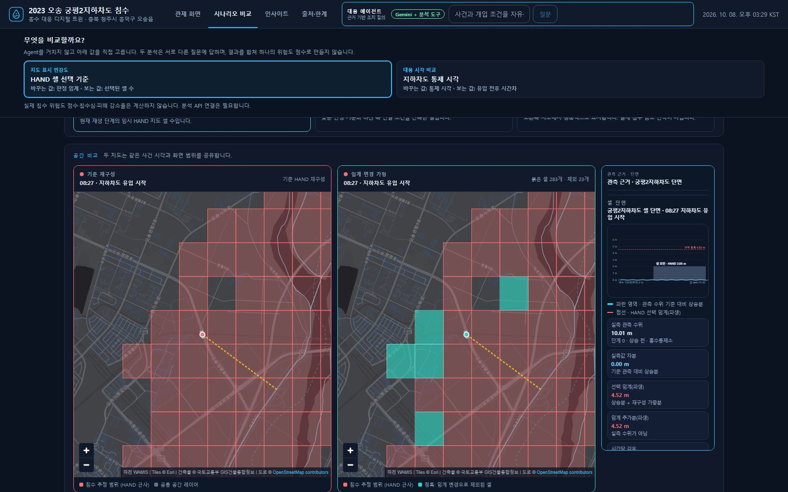
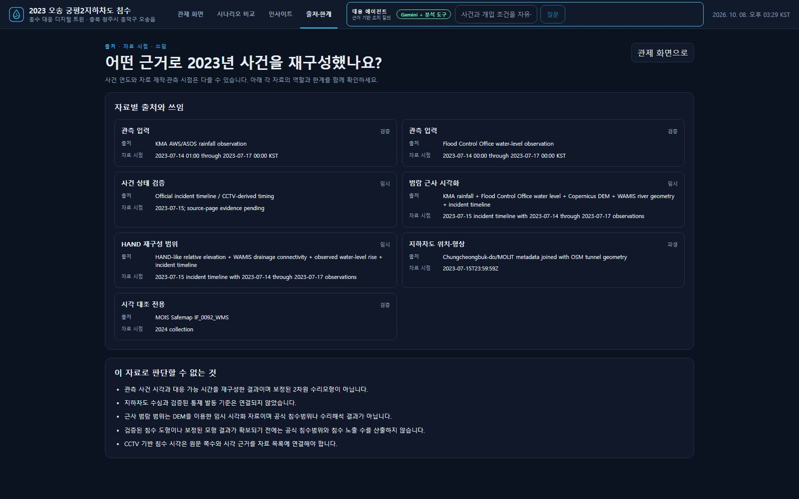

# FloodOps

<p align="center">
  <a href="https://floodops.duckdns.org/">
    
  </a>
</p>

<p align="center">
  <a href="https://floodops.duckdns.org/"></a>
  <a href="https://floodops.duckdns.org/docs"></a>
</p>

**같은 재난에서 더 일찍 대응하려면 무엇을 알아야 할까요?** FloodOps는 관측·공간 자료로 과거 홍수를 재구성하고, 통제·대피 시점을 바꿔 대응 여유 시간을 비교하는 의사결정 지원 PoC입니다.

> 2026-10-08 확인: 공개 서버의 `/health`는 200이고, `/api/agent/planner-status`는 `gemini-3.5-flash-lite` 모델로 Agent가 연결되어 있음을 보고합니다. Agent 호출은 IP당 분당 6회·하루 60회, 서비스 전체 하루 500회로 제한됩니다. 공개 배포본은 수동으로 다시 빌드해야 로컬 수정이 반영됩니다([배포 기록](docs/DEPLOY_AWS.md)).

## 기술 스택

| 영역 | 기술 |
| --- | --- |
| 프런트엔드 | React 18 · TypeScript · Vite · MapLibre GL JS |
| 백엔드 | FastAPI · Pydantic · Shapely |
| Agent | Gemini API(REST, `httpx` 직접 호출) |
| 테스트 | pytest · Vitest · Playwright |
| 배포 | Docker · AWS EC2 |

- **MapLibre GL JS** — 사건 레이어(건물·도로·하천·HAND 셀)를 GeoJSON 그대로 지도에 올립니다. 별도 벡터 타일 서버가 없습니다.
- **FastAPI + Pydantic** — 요청·응답을 타입으로 선언해 `/docs`(Swagger)를 자동 생성하고, 통제 시각·HAND 임계 같은 분석 API 입력값을 서버가 검증합니다.
- **Shapely** — HAND 근사 재구성과 반경별 시설 재고 집계 등 지오메트리 연산에 씁니다.
- **Gemini REST 직접 호출** — SDK 없이 `httpx`로 호출하고, 서버가 등록된 7개 도구만 실행하도록 직접 검증합니다. 모델은 분석값을 만들지 않고 도구를 선택할 뿐입니다.

## 한눈에 보기



각 층이 무엇을 뒷받침하는지는 [구조 문서](docs/ARCHITECTURE.md)와 [데이터 안내](docs/DATA_GUIDE.md)에 있습니다. 근사 침수범위는 임시 재구성 보조 자료이며, 검증된 범위가 확보되기 전까지 침수 노출 지표는 계산하지 않습니다.

## 현재 구현 범위

| 사례 | 화면·자료 상태 |
| --- | --- |
| 2023 오송 지하차도 | 관제·사건 재생·시나리오 비교 가능 |
| 2022 서울 도림천 유역 침수 | 관제·사건 재생·반사실 비교(경보 시각, 빗물터널 저류) 가능. 공식 침수흔적도 기준 노출 |
| 2022 포항 냉천·지하주차장 | 사건 시각 재생·반사실 비교(지하주차장 진입 금지 안내 시각) 가능. 시각은 언론 보도 기준, 침수범위 미연결 |
| 2024 익산 극한호우 (산북천 유역) | 사건 목록 등록. 시각이 확인된 사건이 없어 잠금 유지 |
| 2026 안동·의성 복합재난 | 사건 시각 재생·반사실 비교(대피명령, 산사태 위기경보 시각) 가능. 시각은 언론 보도 기준, 침수범위 미연결 |

접속 흐름은 **소개 → 사례 선택 → 오송 또는 서울 관제**입니다. 오송 관제 화면에서는 7단계 사건 재생, 지도 레이어와 관측 근거, 시나리오 비교, Agent 질의를 볼 수 있습니다. 서울 관제 화면은 강우계 관측과 보도된 사건 시각으로 7단계를 재생하고, 공식 침수흔적도를 지도에 올리며, "강우 임계 기반 경보"와 "도림천 빗물터널" 두 반사실을 계산합니다. 포항과 안동·의성은 공식 침수범위·강우계 자료 없이 보도된 사건 시각만으로 재생하고, 대응 시각 하나를 옮겨 이후 사건까지 남는 시간을 계산합니다. 사례 선택 화면의 "사례 간 비교"는 네 사례의 실제 대응과 반사실 대응이 기준 사건보다 몇 분 앞섰는지를 한 축에 모아 보여줍니다(`GET /api/cases/lead-times`). Agent는 네 사례 모두에서 사건별로 등록된 도구(오송 통제·지연, 서울 경보 시각·저류, 포항·안동 대응 시각)를 골라 답합니다. 익산은 시각 근거가 없어 잠겨 있습니다. 사건 목록 등록을 분석 자료 연결 완료로 해석하면 안 됩니다.

### 오송에서 할 수 있는 일

- **사건 재구성:** 강우·수위 관측, 사건 단계, 도로·건물·하천·지형 자료와 임시 HAND 침수 추정 셀을 같은 지도에서 검토합니다.
- **지하차도 통제 시각 비교:** 지정 시각부터 신규 진입을 막았다는 가정 아래, 유입·주행불능 등 재구성 시각까지 남은 시간을 비교합니다. 물의 진행이나 이미 진입한 차량의 결과는 바꾸지 않습니다.
- **HAND 판정 기준 민감도:** 선택 임계를 0~2.5 m 낮추고 같은 사건 단계의 지도 셀을 다시 선택합니다. 08:27 단계에서 1.5 m 감소 예시는 기준 306셀, 변경 후 283셀, 제외 23셀입니다. 이 수치는 지도 선택 규칙의 변화이며 제방 증고·차수벽 설치의 물리적 효과가 아닙니다.
- **주변 시설 재고:** 지하차도 주변의 연결된 건물·도로·시설을 반경별로 집계합니다. 재고 수를 침수 피해량으로 해석하지 않습니다.
- **Agent 질의:** Gemini가 등록된 읽기 전용 도구를 선택하고 결과를 확인한 뒤 근거 번호와 도구 호출 내역을 보여줍니다. 최대 4회 도구 호출을 허용하며, 도구명과 사용자 입력값을 서버에서 검증합니다.

## 화면

<table>
  <tr>
    <td width="50%" align="center" valign="top">
      <b>사례 선택</b><br>
      <br>
      <sub>현재 등록된 5개 사례 중 관제 가능한 사례를 고릅니다</sub>
    </td>
    <td width="50%" align="center" valign="top">
      <b>관제 화면</b><br>
      <br>
      <sub>사건 단계를 재생하며 지도 레이어와 관측 근거를 함께 봅니다</sub>
    </td>
  </tr>
  <tr>
    <td width="50%" align="center" valign="top">
      <b>시나리오 비교</b><br>
      <br>
      <sub>HAND 판정 임계를 낮춰 같은 시각의 선택 셀 변화를 나란히 봅니다</sub>
    </td>
    <td width="50%" align="center" valign="top">
      <b>출처·한계</b><br>
      <br>
      <sub>자료별 출처·시점·역할과 이 자료로 판단할 수 없는 것을 함께 보여줍니다</sub>
    </td>
  </tr>
</table>

## Agent가 답하는 범위

로컬 서버에 유효한 `GEMINI_API_KEY`가 있을 때 관제 화면은 `POST /api/agent/ask`를 사용합니다. 질문, 최근 대화, 도구 결과가 Gemini에 전달됩니다. Agent는 사건 조회·재구성, 통제 시각, 명시한 유입 지연, 주변 시설 재고, 기준 시나리오 비교, HAND 임계 민감도 등 **등록된 7개 도구** 중에서 선택합니다. 답변에는 호출 결과와 `[1]` 같은 근거 번호를 남기며, 후속 질문을 제안할 수 있습니다.

예를 들어 다음처럼 물어볼 수 있습니다.

```text
08:25에 지하차도를 통제했다면 유입까지 몇 분 남나요?
HAND 선택 임계를 1.5m 낮추면 단계별 붉은 셀이 어떻게 바뀌나요?
지하차도 반경 500m 안에 건물이 몇 개인가요?
```

`제방을 3미터 올린다면?`은 자연어로 해석할 수 있어도 **실제 수위·침수 범위 변화는 계산할 수 없습니다.** 제방 단면과 변경 위치, 유량·수위 경계조건, 검증된 수리모형이 연결되지 않았습니다. 서버는 제방 높이를 HAND 임계 변경량으로 대입하지 않으며, 계산할 수 없는 효과는 `NEEDS_DATA`와 구체적인 한계로 돌려줍니다. Gemini 연결 실패나 키 부재는 `UNAVAILABLE`입니다. 사용법 질문은 등록된 예시로 안내할 수 있습니다.

이전의 `POST /api/agent/plan`과 `POST /api/agent/workflows`도 남아 있습니다. `/plan`은 Gemini가 없으면 규칙 기반 계획으로 전환하지만, **주 Agent 질의인 `/ask`에는 이 전환이 적용되지 않습니다.** Agent 없이도 시나리오 비교 화면에서 통제 시각과 HAND 기준을 직접 조절할 수 있습니다.

## 자료와 해석 기준

```text
관측·원자료 → 출처와 품질 확인 → 오송 사건 재구성 → 등록된 분석 도구
                                            ├─ 관제·지도·시나리오 비교
                                            └─ Gemini Agent의 도구 호출과 근거 답변
```

`approx_flood_envelope`와 HAND 셀은 지형을 이용한 **임시 근사 재구성**입니다. 공식 침수범위, 실측 침수심·유속 또는 검증된 수리해석 결과가 아닙니다. 공식 침수 도형이 필요한 노출·피해 지표는 `PENDING_FLOOD_EXTENT`로 남겨 둡니다. 일부 사건 단계 시각에는 원문 페이지 재확인이 필요한 `NEEDS_SOURCE_PAGE` 상태가 표시됩니다. 시나리오 결과에서 사망 예방, 피해액 감소, 침수심 변화 같은 효과를 산출하지 않습니다.

데이터 출처·이용 조건과 가용 상태는 [`data/manifests/`](data/manifests/) 및 [데이터 품질 기록](docs/data-quality.md)에 정리되어 있습니다. 시나리오 저장은 현재 메모리 기반이고 PostGIS 연계는 보류 상태입니다.

## 주요 API

| 경로 | 용도 |
| --- | --- |
| `GET /api/events` | 5개 사건 목록과 자료 상태 |
| `GET /api/events/osong-2023/reconstruction` | 오송 사건 단계와 출처 |
| `GET /api/events/osong-2023/layers` | 지도 레이어 |
| `POST /api/events/osong-2023/analysis/closure-timing` | 통제 시각 비교 |
| `POST /api/events/osong-2023/analysis/hand-threshold` | HAND 선택 셀 민감도 |
| `GET /api/events/osong-2023/exposure-inventory` | 반경별 시설 재고 |
| `GET /api/agent/examples` | 등록 도구로 답할 수 있는 예시 질문 |
| `POST /api/agent/ask` | Gemini의 연속 도구 호출과 근거 답변 |

건물별 개입 시나리오 API(`POST /api/scenarios`, `POST /api/scenarios/{id}/run`)는 건물 ID와 자료 연결 상태를 검사합니다. 검증된 개입 모델이 없어 효과 지표는 `UNAVAILABLE`로 반환하며 전후 위험도 감소를 만들어 내지 않습니다.

## 검증

```powershell
python -m pytest backend/tests -q
npm test
npm run build
npx playwright install --only-shell chromium
npm run test:e2e
```

Playwright E2E는 FastAPI(`8035`)와 Vite(`5175`)를 자동으로 띄워 오송 진입·사건 재생·레이어 설정·출처·한계 화면·통제 시각 비교를 확인합니다. 2026-10-04 기준 백엔드 테스트 118개, Vitest 5개, Playwright E2E 3개가 통과했습니다.

## 관련 문서

- [프로젝트 계획](docs/PROJECT_PLAN.md) · [개발 가이드](docs/DEVELOPMENT_GUIDE.md) · [아키텍처](docs/ARCHITECTURE.md)
- [데이터 가이드](docs/DATA_GUIDE.md) · [데이터 폴더](data/README.md) · [데이터 품질 기록](docs/data-quality.md)
- [의사결정 기록](docs/DECISIONS.md) · [작업 기록](WORKLOG.md) · [현재 TODO](TODO.md)
